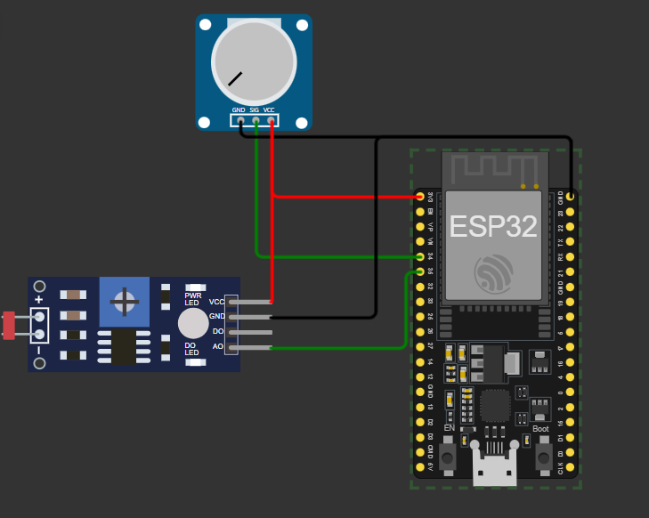

# Teste Diel - 

Este projeto foi feito para o desafio técnico da Diel energia. Utilizando um ESP32 para coletar os dados dos sensores e enviar para um broker MQTT. O ESP32 lê os dados dos sensores, categoriza e os envia por meio de tópicos MQTT para o monitoramento e controle.

## Tecnologias usadas

**Cliente:** C++, Json, MQTT

**Broker:** Mosquitto

**Hardware:** ESP32, Servidor, Conexão Wi-Fi

**Sensores:** Potenciômetro e LDR

## Diagrama 

## Execução

Baixe esse repositório ou faça um clone

Instale as Bibliotecas
   - [PubSubClient](https://github.com/knolleary/pubsubclient): Biblioteca para comunicação MQTT.
   - [ArduinoJson](https://github.com/bblanchon/ArduinoJson): Biblioteca para manipulação de JSON.

    1. Conecte o ESP32
    2. Abra o código pela IDE do Arudino
    3. Configure o arquirvo config.h
    4. Faça o upload do código para o ESP32.
    5. Abra o monitor Serial para monitor a comunicação

    
## Créditos
- [Pepyn](https://github.com/Phepyn1): Criador do projeto.
